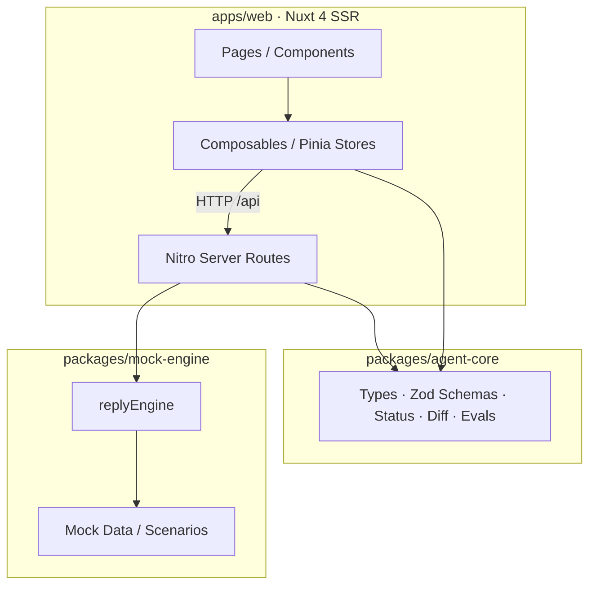

# Agent Factory 智能体工作台

[English](README.md) | 简体中文

面向非开发者与开发者混合人群的 AI Agent 低代码构建平台。当前聚焦单个 Agent 的创建与调试闭环：配置人设、模型与能力，在 Playground 中即时验证，并完成保存、发布、版本 diff、回滚与一键回归。

<p align="center">
  <a href="https://agent-factory-vert.vercel.app"></a>
  <a href="https://agent-factory.jiawen.live"></a>
  <a href="https://github.com/zzlw/agent-factory/deployments"></a>
  <a href="./LICENSE"></a>
  <a href="https://github.com/zzlw/agent-factory/commits/main"></a>
</p>

<p align="center">
  <a href="https://nuxt.com"></a>
  <a href="https://vuejs.org"></a>
  <a href="https://www.typescriptlang.org"></a>
  <a href="https://tailwindcss.com"></a>
  <a href="https://pnpm.io"></a>
</p>

## 在线体验

- 默认地址：https://agent-factory-vert.vercel.app
- 国内镜像：https://agent-factory.jiawen.live

默认 Vercel 域名在国内网络环境下可能不稳定；国内用户请优先使用 `agent-factory.jiawen.live`。

## 功能特性

- **三栏工作台**：侧栏、配置面板与 Playground 同屏，分区切换不卸载组件树，会话与编辑状态自然保留。
- **Agent 配置**：人设与开场、模型与语音、能力（Tool / Skill / Knowledge Base）开关管理。
- **状态机**：`Draft` / `Saved` / `Published` 三态，由三个配置快照实时推导。
- **Playground**：流式回复、工具调用卡片、执行轨迹 Trace、测试场景一键回归。
- **保存与发布**：支持 `Cmd/Ctrl+S` 保存、发布说明 changelog。
- **版本管理**：不可变发布历史、字段级 diff、回滚到历史版本。
- **Evals-lite**：基于 `ScenarioAssertion` 对实际回复与 Trace 做轻量回归断言。
- **主题系统**：明暗模式与多套主题色调预设，并通过 Cookie 持久化。
- **URL 状态分层**：分区走 path，Playground / 侧栏开关走 query，刷新、分享、前进后退均可恢复。
- **PWA**：可安装为独立应用，新版本就绪时提示刷新。

## 技术栈

- pnpm monorepo + Nuxt 4（SSR）+ Vue 3 + TypeScript
- Pinia + Pinia Colada
- shadcn-vue（Reka UI）+ Tailwind CSS v4
- ai-elements-vue + vue-stream-markdown
- TanStack Vue Table v8 + vee-validate + @vee-validate/zod
- Zod + fast-deep-equal + nanoid + date-fns
- Nitro Server Routes（Mock API）
- @nuxtjs/color-mode
- @vite-pwa/nuxt
- Biome

## 快速开始

```bash
pnpm install
pnpm dev
```

打开 `http://localhost:3000`。其他命令：

```bash
pnpm build      # 生产构建
pnpm preview    # 预览生产构建（验证 PWA 需走此路径）
pnpm typecheck  # 全仓类型检查
pnpm lint       # Biome 检查
pnpm lint:fix   # Biome 检查并自动修复
```

## 目录结构

```text
apps/web/
  components/    展示与交互组件（不直接调用 $fetch）
  composables/   可复用的客户端逻辑
  stores/        Pinia 全局状态与三快照状态机
  pages/         分区路由入口
  server/api/    Nitro Mock API
  lib/           UI 基础工具
packages/
  agent-core/    纯 TS 领域包（类型、状态推导、Evals、Zod Schema、diff）
  mock-engine/   Mock 数据、测试场景与回复规则引擎
```

## 架构总览



Web 应用负责 UI 与客户端状态，通过 `$fetch('/api/...')` 访问 Nitro Server Routes；领域规则集中在 `agent-core`，Server Routes 再调用 `mock-engine` 依据请求快照生成结构化回复。

## 核心架构

- **三快照状态机**：`config` / `savedConfig` / `publishedConfig` 通过 `fast-deep-equal` 推导状态。
- **不变量**：`publishedConfig === publishHistory[last].config`，`version === publishHistory[last].version`。
- **状态边界**：Pinia 只维护跨组件共享的 Agent 配置与发布状态；消息流和 Trace 由 `useMockChat` 管理，不放进 Pinia。
- **请求快照**：Playground 每次对话请求体携带当前 `config` 快照，`mock-engine` 依据请求体回复，不读取前端全局状态。
- **服务端边界**：前端统一使用 `$fetch('/api/...')`，Nitro Server Route 负责结构化响应。

## 演示走查

```text
1. 打开 /overview，查看当前 Agent 状态、能力摘要与线上差异
2. 在 Playground 使用测试场景芯片发送“测试天气查询”
3. 修改 System Prompt，顶栏状态变为 Draft
4. 展开助手消息的“执行轨迹”查看 Trace
5. 点击“运行全部场景”，查看场景通过 / 失败摘要
6. 保存（或 Cmd/Ctrl+S），状态变为 Saved
7. 点击“发布更新”，填写发布说明，生成新版本
8. 再次修改配置，进入 /versions 查看字段级 diff
9. 从历史版本点击“回滚到此版本”，配置载入草稿
```

## 部署与国内访问

- Vercel 自动识别 Nuxt：Root Directory 设为 `apps/web`，Build / Install / Output 均使用自动检测，仓库中不维护 `vercel.json`。
- 默认地址：`https://agent-factory-vert.vercel.app`
- 国内镜像：`https://agent-factory.jiawen.live`（通过 Cloudflare 权威 DNS 做 DNS-only CNAME 到 Vercel 中国区节点）

复现方式：

```bash
vercel domains add agent-factory.jiawen.live agent-factory

curl -X POST "https://api.cloudflare.com/client/v4/zones/<zone_id>/dns_records" \
  -H "Authorization: Bearer <api_token>" -H "Content-Type: application/json" \
  -d '{"type":"CNAME","name":"agent-factory","content":"cname-china.vercel-dns.com","proxied":false}'

vercel domains verify agent-factory.jiawen.live
```

要点：CNAME 必须关闭 Cloudflare 代理（灰云 / DNS only），流量直达 `cname-china.vercel-dns.com`；开橙云会绕行 Cloudflare 代理并与 Vercel 证书冲突。

## 依赖说明

- `esbuild` 在 `pnpm-workspace.yaml` 中被固定为 `0.27.7`：pnpm 11 在重解析锁文件时会把 `esbuild@0.28.x` 的平台可选依赖（`@esbuild/darwin-arm64` 等）丢掉，导致 Nitro 构建报 `Host version 0.28.2 does not match binary version 0.27.7`。固定到已锁定的 `0.27.7` 后 esbuild 只保留一份，平台依赖完整。
- 本地包通过 workspace 协议引用，Nuxt 在 `nuxt.config.ts` 中声明了 `build.transpile`。

## 许可证

MIT © 2026 zzlw
