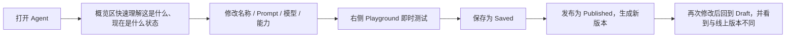
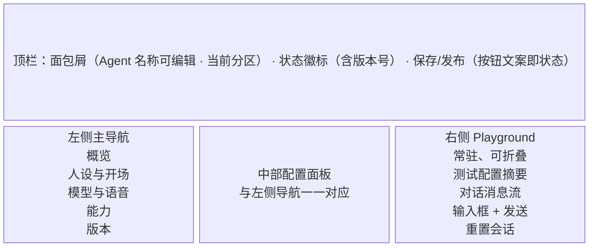
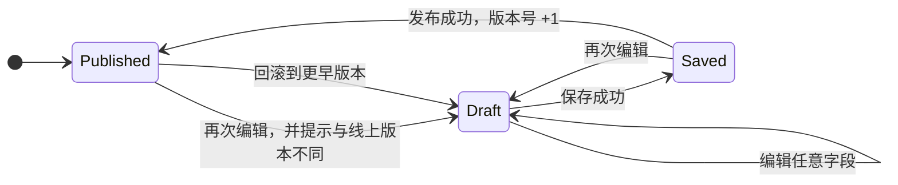

# Agent Factory 智能体工作台 — 实现方案（终版）

> 对应作业：[前端线下任务.md](./前端线下任务.md)
> 技术栈：pnpm monorepo + Vue 3 + TypeScript + Nuxt 4 + Pinia + Pinia Colada + shadcn-vue（Reka UI，shadcn-nuxt 模块注册）+ ai-elements-vue（AI 对话组件，组件即源码）+ Tailwind CSS v4 + @nuxt/fonts + @fontsource-variable/geist + vue-stream-markdown + shiki + TanStack Vue Table + Zod + @vueuse/core + fast-deep-equal + nanoid + date-fns + Nitro Server Routes + Biome
> 文档约定：后续所有 Markdown 文档中的图示一律使用 Mermaid 绘制。

---

## 一、产品理解

### 1.1 产品定位

Agent Factory 是一个面向 **非开发者与开发者混合人群** 的 AI Agent 低代码构建平台。用户通过配置 Prompt、First Message、模型与能力（Tool / Skill / Knowledge Base），即可搭建、测试并发布一个可对话、可执行任务的智能体。

本页面不是“配置表单页”，而是 Agent 的 **工作台**：用户需要在这里完成“理解当前 Agent → 修改配置 → 验证效果 → 发布上线”的完整闭环。

### 1.2 目标用户

| 用户 | 特征 | 核心诉求 |
|---|---|---|
| 主用户：Agent 搭建者 | 懂业务，不一定写代码；反复调整 Prompt 与能力 | 配置直观、测试反馈快、清楚自己改了什么 |
| 次用户：团队协作者 | 关心线上稳定性与版本状态 | 快速识别草稿、已保存、已发布的差异 |

### 1.3 核心用户旅程



### 1.4 本页面必须回答的三个问题

1. 我正在编辑的是哪个 Agent，它现在处于什么状态？
2. 我修改了哪些配置，这些修改保存了吗、发布了吗？
3. 我在 Playground 里测试的到底是草稿、已保存版本还是线上版本？

这三条对应题目的“了解 Agent / 感知状态 / 测试 Agent”，是本方案所有交互设计的依据。

---

## 二、范围与明确取舍

### 2.1 本期完成

- Agent 概览：名称、用途、模型、能力摘要、状态、版本；
- 核心配置：System Prompt、First Message、描述，并支持 Prompt 模板与变量提示；
- 模型与语音：模型选择、Temperature、语音只读展示；
- 能力管理：Tool / Skill / Knowledge Base 卡片与启停，Mock 工具标注 “MCP” 接入徽标（对齐 2026 工具接入事实标准，仅展示层，不做真实协议实现）；
- Playground：常驻对话测试，Mock 回复与当前配置联动，支持测试场景与执行轨迹；
- 状态机：Draft / Saved / Published、脏检查、保存、发布、版本号；
- Mock 基建：Nuxt Nitro Server Routes 本地模拟 API，`$fetch` 走相对路径，Network 面板可见 `/api/...` 请求与响应；
- 版本信息：当前版本、发布记录、线上配置快照对比与变更 diff；
- 版本回滚：从发布记录一键回滚到更早的历史版本（Mock 实现；最新线上版本不提供回滚入口——回滚到线上等于无操作；回滚后进入 Draft，需再次保存/发布才生效）。

### 2.2 明确不做

- 多 Agent 列表页、权限与协作；
- 真实大模型、真实语音、真实 RAG；
- 完整的语音参数配置；
- A/B 测试与灰度发布（ElevenLabs 已标配的能力，但依赖流量分发与数据积累，超出本期交付范围）；
- 复杂自动化测试、后端服务。

### 2.3 取舍理由

题目要求的是一个“创建与调试页面”，而不是完整产品。把精力优先投入在 **状态机 + Playground + 信息架构** 上，比铺开多页面更能证明产品判断。语音只做只读展示，是因为语音 Mock 无法带来可信的演示效果，反而会分散注意力。

---

## 三、信息架构

### 3.1 总布局：顶栏 + 三栏



该布局的工程底座迁移自 `nuxt-shadcn-dashboard`（Nuxt 版 Dashboard Shell，54 个 shadcn 组件目录全量复用）：

- **Sidebar**：`collapsible="icon"` 可折叠主导航（折叠为纯图标栏，宽度 200ms ease-linear 过渡），品牌区 + “配置”分组五项 + 底部用户模块（Mock 数据 + toast 演示反馈）；
- **Header**：Sticky Header，两段式面包屑承载 Agent 名称（inline 编辑，`field-sizing: content` 自适应宽度）与当前分区名；状态徽标（状态 · 版本号）紧贴身份区；右侧为纯动作区（保存 / 发布，发布按钮文案随 `hasUnpublishedChanges` 切换“发布 / 发布更新”）；
- **Main**：中部内容区 `@container/main` 容器查询，配置面板按内容区实际可用宽度双列重排（侧栏折叠或 Playground 收起时自动变宽）；
- **Aside**：右侧 Playground，桌面端常驻，可折叠为窄竖轨，宽度过渡动画与 Sidebar 同款；窄屏下转为抽屉 / 覆盖层。

虽然题目只要求一个 Agent 创建与调试页面，但左侧导航对应的是 **path 路由**（`/overview`、`/persona`、`/model`、`/abilities`、`/versions`）：分区是“页面”语义，刷新、分享链接、浏览器后退均天然恢复（对齐 Dify / Linear 的分区路由惯例）。工程上由 `pages/[section].vue` 动态路由单页承载——分区切换只变路由参数、不卸载组件树，Playground 会话与编辑状态天然保留。

### 3.2 导航规则

左侧导航是 **唯一主导航**，中部内容区不再套一层 Tabs，避免双重导航。左侧五项与中部面板一一对应：

**URL 状态分层**（`useWorkbench` 统一实现，已落地）：

- **分区 = path**（`/persona`、`?playground=0` 不变）：页面语义，`router.push` 导航可后退；非法分区 path 由 `definePageMeta validate` 直接 404；根路径 `/` 重定向到 `/overview`（打开工作台先看概览）；
- **视图状态 = query**（`?playground=0`、`?sidebar=0`、`?pw=420`）：Playground 抽屉、侧栏折叠与 Playground 拖拽宽度都是视图状态而非页面，`router.replace` 更新不污染历史栈；默认态不写入 query，保持 URL 干净；path 导航时 query 随行保留。宽度在拖拽结束时一次性写入（拖拽中逐帧 replace 太重），不依赖 localStorage（内嵌 webview 可能不可用），非法值回落默认宽度。

| 左侧导航 | 中部内容 | 目标 |
|---|---|---|
| 概览 | Agent 快照、状态卡、能力摘要、发布状态 | 进入页面后 10 秒内理解当前 Agent |
| 人设与开场 | 名称、用途、System Prompt、First Message | 修改最高频的身份与开场配置 |
| 模型与语音 | 模型、Temperature、语音展示 | 调整模型行为 |
| 能力 | Tool / Skill / Knowledge Base | 管理 Agent 可执行能力 |
| 版本 | 当前版本、发布时间、历史记录 | 感知发布与线上状态 |

### 3.3 概览区设计

“概览”是题目要求“了解当前正在编辑的 Agent”的核心，目标是进入页面后 **10 秒内**理解当前 Agent。为避免信息过载（参考 Dify 概览页做法），按视觉层级分两层：

**主视觉（一屏聚焦 2～3 项）**：

- Agent 名称与用途描述；
- 状态卡：Draft / Saved / Published，附未保存更改 / 与线上版本不同提示；
- 与线上版本的差异摘要，例如“Prompt 已修改”“启用了天气查询”，并提供版本 diff 入口。

**次要信息（弱化样式，快速扫读）**：

- 当前模型与 Temperature；
- 已启用能力数量，按 Tool / Skill / Knowledge Base 分类；
- 最近保存时间、最近发布时间、当前版本号。

### 3.4 视觉风格与交互规范

整体采用现代 SaaS Dashboard 风格，借鉴 `next-shadcn-dashboard-starter` 的信息密度、模块化和反馈体系，但使用 Vue/Nuxt 生态实现：

- 布局：左侧可折叠 Sidebar + 顶部 Sticky Header + 主内容区 + 右侧 Playground；
- 视觉：中性浅灰背景、白色卡片、弱边框、轻阴影；主色为联想品牌红 `#E1251B`（亮色 `oklch(0.585 0.221 29.2)`；暗色提亮降饱和为 `oklch(0.64 0.21 29)` 且前景色翻转为深色，保证对比度）；
- 状态徽标：Badge 三档变体区分——Draft `outline`、Saved `secondary`、Published `default`（品牌红填充）；错误用 `destructive`；
- 密度：桌面端信息密度高，但卡片、表单、表格保持清晰可扫描；
- 字体：Geist Variable / Geist Mono Variable（`@nuxt/fonts` + `@fontsource-variable` 可变字体，100–900 全字重，附带回退字体度量校准消除布局抖动）；中文回落系统 PingFang SC，全局不启用 `antialiased`（该渲染模式为西文优化，会把中文笔画压虚）；Prompt / 代码使用等宽字体；
- 圆角：卡片 8px，弹窗 10px；
- 图标：`lucide-vue-next`，统一线性风格；
- 提示：`vue-sonner` 负责成功、失败、加载后的非阻塞反馈；
- 动效：过渡 120～160ms，只用于状态变化，不做无意义动画；
- 滚动条：滚动容器统一使用 shadcn-vue / Reka UI 的 `ScrollArea` 组件，不手写 WebKit / Firefox 滚动条样式；外层页面保留浏览器原生滚动行为。
- 可访问性：状态不只用颜色表达，弹窗焦点锁定，输入框 Enter / Shift+Enter 行为明确。

交互标准对齐 Dashboard Starter：

- 异步区域提供 Loading Skeleton，不出现布局跳动；
- 空状态提供下一步动作，而不是只显示“暂无数据”；
- 表格支持搜索、过滤、排序和分页；
- 保存 / 发布 / 回滚使用 mutation loading 与失败恢复；
- 顶部提供快捷键入口，至少支持 `Cmd/Ctrl + S` 保存；
- 配置变更后出现明确但不过度打扰的未保存提示；
- Playground 支持折叠、重置、停止生成和重新生成。

**丝滑动画与微交互细则**：

- Sidebar 折叠与 Playground 抽屉统一为 200ms ease-linear 的单一容器宽度过渡 + 内容层 opacity（内容固定宽度防过渡期重排），内容区不产生布局跳动；
- 子菜单展开 / 收起使用 Reka Accordion / Collapsible 的高度过渡；
- 弹窗使用 120～160ms 的 fade + scale，抽屉使用 slide-in；
- 按钮 hover 使用轻微背景 / 边框变化，active 状态只做极短反馈；
- Skeleton 使用 shimmer，数据加载完成后淡入，避免高度突变；
- Toast 使用 `vue-sonner` 的进入 / 退出动画；
- 表格行 hover 高亮，排序图标切换有短过渡；
- 分区切换为瞬时切换（无过渡动画）：占位期的面板视觉同质，过渡无信息量；保留滚动回顶行为；
- 遵循 `prefers-reduced-motion`，用户关闭动画时降级为无动画。
- Playground、Sidebar、表格和内容区统一使用 Reka UI `ScrollArea`，避免各自硬编码滚动行为。

---

## 四、状态机设计

### 4.1 状态定义

```ts
type AgentStatus = 'draft' | 'saved' | 'published';

interface AgentSnapshot {
  config: AgentConfig;
  savedAt: string | null;
  publishedAt: string | null;
  version: number;
  changelog?: string; // 发布说明，展示在版本记录中
}
```

### 4.2 三份数据

状态机不依赖一个简单 status 字段，而是维护三份配置：

| 数据 | 含义 |
|---|---|
| `config` | 用户当前正在编辑的配置 |
| `savedConfig` | 最近一次成功保存的配置 |
| `publishedConfig` | 最近一次成功发布的线上配置 |

状态由配置差异推导：

```ts
import equal from 'fast-deep-equal';

const hasUnsavedChanges = !equal(config, savedConfig);
const hasUnpublishedChanges = !equal(savedConfig, publishedConfig);
const status = hasUnsavedChanges
  ? 'draft'
  : hasUnpublishedChanges
    ? 'saved'
    : 'published';
```

### 4.3 状态流转



**初始 Mock 状态约定为 Published v2**（config == savedConfig == publishedConfig）：保证演示第一分钟就能展示“改动 → Draft”的完整状态弧线；若初始为 Draft，三态展示会明显变弱。版本历史预置 v1、v2 两条发布记录（各含发布说明 changelog），供版本页、diff 与回滚取数，并始终保持不变式：publishedConfig === publishHistory 最后一项的 config，version === 最后一项的 version——两条数据源永不分叉。

### 4.4 必须处理的边界

- 保存 / 发布过程中显示 loading，并禁止重复点击；
- 保存 / 发布失败时展示错误提示，保留当前编辑内容；
- “发布”包含保存动作，二次确认弹窗中明确提示“将保存并发布当前配置”，并提供可选的发布说明输入（写入 changelog，展示在版本记录中）；
- “与线上版本不同”不等于“未保存”，两者需要独立文案；
- 可选增强：草稿自动保存使用 800ms debounce，自动保存只产生 Saved，不发布；如需简化，可降级为手动保存 + `beforeunload`；
- 切换左侧导航不丢失编辑内容；
- 浏览器刷新前，若存在未保存更改，用 `beforeunload` 提示；
- Playground 顶部始终标明“正在测试当前编辑配置”，Draft 状态下额外强调。

---

## 五、Playground 设计

### 5.1 位置与形态

右侧常驻面板，支持折叠。配置修改后无需跳转即可测试，这是本页面最重要的体验设计。

### 5.2 测试配置摘要

Playground 顶部固定展示当前测试所依据的配置摘要：

- 模型名称；
- Temperature；
- System Prompt 前 80 个字符；
- 已启用 Tool / Skill / Knowledge Base 数量；
- 当前状态：Draft / Saved / Published。

这样用户始终知道“我测试的是哪份配置”。

### 5.3 消息流

- 支持用户消息、Assistant 消息、工具调用消息；
- 支持 Markdown 渲染；
- 显示加载中的打字指示器；
- 每条消息显示时间，并按时间排序；
- 空会话时首先渲染 First Message 气泡——这本身就是测试 First Message 最自然的方式，比场景芯片更贴合；
- 新消息到达时自动滚动到底部；
- 提供“重置会话”、测试场景芯片和“使用 First Message 快速测试”。

### 5.4 测试场景芯片

为降低手动输入的不确定性，Playground 顶部提供固定场景按钮，点击后自动填充用户消息并发送。场景由 Mock 数据预置，保证演示稳定，也便于回归验证配置变更：

| 场景 | 输入示例 | 验证目标 |
|---|---|---|
| 测试天气查询 | “北京今天天气怎么样？” | 验证天气 Tool 开关是否生效 |
| 测试知识库 | “退款政策是什么？” | 验证 Knowledge Base 开关是否生效 |
| 测试翻译 | “请把‘你好，我是智能助手’翻译成英文” | 验证翻译 Skill 开关是否生效 |
| 测试人设 | “你是谁？” | 验证 System Prompt 是否被引用 |
| 测试兜底 | “随便聊聊” | 验证 First Message 兜底回复 |

**一键回归（Evals-lite）**：提供“运行全部场景”按钮，自动顺序执行 5 个场景并输出通过/失败摘要。通过/失败由每个场景的断言（`ScenarioAssertion`：requiresCapability / mustCallTool / replyContains）对实际回复与 Trace **计算得出**，而非硬编码——回归结果是验证出来的，不是演出来的。这是对 2026 年 Agent 构建器第一主题——评估——的最小呼应（OpenAI AgentKit 将 Evals 列为三大核心组件之一，UiPath 提供智能体就绪评分）：把“逐个测试”升维为“一键验证”。归入 L4 交付层（见第七节）。回归启动前自动复位失败开关（mockFailNext），确保结果只反映配置本身；失败路径演示独立于回归流程进行。

### 5.5 Mock 回复规则

不接真实模型，但 Mock 必须与当前配置联动，让演示看起来“配置真的生效”。规则保持少而清晰：

1. 若启用了天气 Tool，且用户输入包含“天气”，返回工具调用样式的消息；
2. 若未启用天气 Tool，且用户询问天气，则回复“我没有天气查询能力”；
3. 若启用了某个 Knowledge Base，且用户询问该知识库相关关键词，返回“已检索知识库”样式的消息；
4. 若输入包含“你是谁”，回复中引用当前 System Prompt 的前 40 个字符；
5. 其他输入返回基于 First Message 的兜底回复。

### 5.6 流式输出实现约束

- 使用 `setInterval` 或异步生成器逐字输出；
- 接口延迟统一由 Nitro Server Route 控制（如 800ms），与线上形态一致；
- 新消息发送、重置会话、组件卸载时，必须清理旧定时器；
- Markdown 渲染由 ai-elements-vue 的 `MessageResponse` 内置（vue-stream-markdown 流式渲染 + shiki 语法高亮），不手拼 `v-html`，无 XSS 面。

### 5.7 执行轨迹（Trace）

为了不让 Agent 变成“黑盒”，每条 Assistant 消息或工具调用消息下提供“查看执行轨迹”入口。Trace 展示（基于 ai-elements-vue 的 Tool 折叠卡片体系，收起时不占视觉重心）：

- 用户输入；
- 命中的知识库条目或检索关键词；
- 被调用的 Tool 名称与参数；
- 模型原始输出；
- 最终展示给用户的输出；
- 每步状态：成功 / 失败 / 进行中（对应 TraceStep 的 success / failed / pending；Mock 引擎在演示失败场景时产生 failed）。

Trace 数据由 Mock 回复引擎同步生成，不接真实模型。演示时可通过“测试天气查询”场景展示“天气查询 Tool 被调用”的完整轨迹。

### 5.8 配置变更与会话的关系

必须定义明确规则，避免“改了配置但对话还在旧上下文”的歧义（这是面试最可能追问的深水区）：

- 配置变更后，已有会话 **保留不清空**（对齐 GPTs builder 预览对话的行为，不静默重置）；
- Playground 顶部追加提示条：“配置已变更，建议重置会话”，并提供一键重置；
- 重置后新会话按当前 config（含新 First Message、新启用能力）回复——每次 chat 请求体携带当前 config 快照，replyEngine 依据请求体回复而非读取全局状态，天然满足该语义（契约见 6.1.2）。

---

## 六、技术方案

### 6.1 技术选型

| 项 | 选择 | 理由 |
|---|---|---|
| 框架 | Nuxt 4 + Vue 3.5+ `<script setup>` + TypeScript | 题目要求 Vue3 + TS；Nuxt 提供文件路由、Nitro 服务端与未来 SSR/SSG 升级空间 |
| 运行时 / 构建 | Nuxt（Nitro + Vite） | 开发体验好，Nitro 统一服务端逻辑，Vite 负责前端构建 |
| 包管理 | pnpm workspace | 2026 年新项目事实默认；统一管理 `apps/web` 与本地 packages |
| 状态 | Pinia 3 + `@pinia/nuxt` | 适合集中管理 Agent 配置与状态机，Nuxt 官方集成方式 |
| 服务端状态 | Pinia Colada | 管理 `/api/...` 查询、缓存、mutation loading、重试与失效刷新 |
| 数据表格 | TanStack Vue Table v8 stable | 能力列表、版本历史支持搜索 / 过滤 / 排序 / 分页 |
| 表单校验 | `vee-validate` + Zod | Dashboard 级表单体验；服务端也可复用 Zod Schema 校验请求 |
| 组件库 | shadcn-vue + Reka UI，经 shadcn-nuxt 模块注册（2026-08 选型，见 6.1.1） | 与 Agent UI 生态同构；组件即源码；54 个组件目录自 nuxt-shadcn-dashboard 全量迁移 |
| Mock / API | Nitro Server Routes（见 6.1.2） | 本地服务端 Mock，`$fetch` 走相对路径，代码形态接近真实后端 |
| 代码质量 | Biome 2.5+（见 6.1.4） | 单一工具统一格式化、lint、import 排序与 Tailwind class 排序 |
| 动画 | CSS `transition` | Sidebar / Playground 宽度过渡 200ms ease-linear；分区切换瞬时无过渡（占位期面板视觉同质，动画无信息量，待真实面板落地后可再评估）；`@vueuse/motion` 视后续弹窗需要再引入 |
| 通用工具 | `@vueuse/core`、`fast-deep-equal`、`nanoid`、`date-fns` | 成熟库优先，避免重复造轮子 |
| Markdown | `vue-stream-markdown` + `shiki`（ai-elements-vue `MessageResponse` 内置） | 流式渲染 + 语法高亮，不手拼 `v-html`，无 XSS 面 |
| 样式 | Tailwind CSS v4 + shadcn-vue 设计令牌（CSS 变量） | shadcn-vue 体系配套底座；视觉默认值高，样式统一成本归零 |
| 字体 | `@nuxt/fonts` + `@fontsource-variable/geist(-mono)` | 可变字体单文件覆盖 100–900 字重；npm provider 纯本地解析（remote: false）离线可演示；自动生成回退字体度量覆写（size-adjust）消除字体加载布局抖动 |
| 图标 / 提示 | `lucide-vue-next` / `vue-sonner` | shadcn-vue 生态标配，替代传统组件库的图标与消息提示 |

### 6.1.1 组件库选型（2026-08）：shadcn-vue + Reka UI

**选定 shadcn-vue + Reka UI**（Tailwind CSS v4 底座 + Reka UI 无头组件），通过 `shadcn-nuxt` 模块在 Nuxt 4 中集成（`prefix: ''` + `componentDir: '~/components/ui'`，注册 index.ts 具名导出）。实际落地方式：从 `nuxt-shadcn-dashboard` 全量迁移 54 个组件目录，排除 9 个重依赖目录（`auto-form` / `form` → vee-validate + Zod、`table` → TanStack、`chart×5` → unovis、`carousel` → embla），待对应面板开工时再按需引入。决策理由：

1. **领域同构**：shadcn 生态 2026 年正把 agent UI（工具调用面板、知识库管理界面、chat 组件）组件化，本作业所做的正是 Agent 工作台——选型与产品领域同一基础设施，答辩时是强叙事；对话界面层直接落地了这一判断（见下方 ai-elements-vue）；
2. **组件即源码**：Playground、Trace、状态徽标等定制界面无需对抗组件库默认样式，直接改组件代码；
3. **视觉默认值高**：开箱即现代观感，“基础样式统一”成本趋近于零，抵消部分组装时间。

#### AI 对话组件：ai-elements-vue（2026-08 落地）

Playground 的消息流、输入区与工具调用展示采用 [ai-elements-vue](https://github.com/vuepont/ai-elements-vue)——Vercel ai elements 的 Vue 移植，以 shadcn-vue registry 形态发布（组件即源码，落地到 `components/ai-elements/`，不引运行时包依赖）。已落地 7 个组件族：

- **Conversation**（`vue-stick-to-bottom`）：消息区自动吸底，用户上滚查看历史时不自动拉底，提供“回到底部”悬浮按钮；
- **Message / MessageContent / MessageResponse**：用户/助手双态气泡（is-user / is-assistant 自定义 variant）；助手消息走 Markdown 渲染（内置 vue-stream-markdown + shiki），悬停显示复制等操作；
- **PromptInput**（Body/Textarea/Footer/Submit）：Enter 提交含中文输入法 composition 保护，提交自动清空、失败恢复草稿；与手写 Textarea + Button 相比输入体验对齐主流 AI 产品；
- **Tool**（Header/Content/Input/Output）：工具调用与执行轨迹的折叠卡片（参数/结果 JSON 展示 + 语法高亮），收起时不占视觉重心；
- **Loader / Suggestion**：生成中加载态与建议芯片。

**选型理由**：与 shadcn-vue 同底座（Tailwind v4 + Reka UI + CSS 变量令牌），零样式体系冲突；组件即源码可按项目定制；对齐 Vercel AI SDK 的消息模型（ai 包 UIMessage），未来接真实模型时数据结构无迁移。**代价**：引入 `ai` / `shiki` / `vue-stream-markdown` / `@lucide/vue` 四个依赖（当前仅用其类型与渲染层，未接 SDK 运行时）；安装走 registry JSON 手动落地（CLI 与本地 components.json schema 不兼容时回退拉源码）。

**选型代价（诚实计入）**：初始化与组件组装比 Element Plus 多一定工程成本，计入 L1 交付层；若组装超时，降级为 Element Plus；强依赖 Tailwind；文档以英文为主。

**Element Plus → shadcn-vue 组件映射**：

| 用途 | 原候选（Element Plus） | 现方案 |
|---|---|---|
| 名称 / 描述 / Prompt | el-input / textarea | Input / Textarea / Label |
| 模型选择 | el-select | Select（Reka UI Listbox） |
| Temperature | el-slider | Slider |
| 能力启停 | el-switch | Switch |
| 发布二次确认 | el-dialog | AlertDialog |
| 状态徽标 | el-tag | Badge |
| 概览 / 能力卡片 | el-card | Card |
| 消息提示 | ElMessage | vue-sonner（Toast） |
| Tabs | el-tabs | 不需要（左导航唯一主导航） |

**表单校验策略**：采用 `vee-validate` + Zod，而不是手写散落校验。名称、Prompt、模型、Temperature 等字段统一使用 Schema 校验；Nitro Server Route 端复用同一 Zod Schema，保证前后端规则一致。

**放弃的候选**：Element Plus（npm 周下载约 52.8 万、Vue 3 装机量第一，表单成熟、中文文档最佳；但默认观感偏后台管理，定制 Playground / Trace 需覆盖样式，转为求稳第一备选）、Naive UI（TS/性能佳，表单生态较弱）、PrimeVue（数据组件最强，本页面无此需求）。

### 6.1.2 Mock / API 方案：Nitro Server Routes

使用 Nuxt 自带的 Nitro Server Routes 提供本地 Mock API：

- 前端通过 `$fetch('/api/agent/...')` 调用相对路径，请求进入 Nuxt 开发服务器的 Server Route；
- `/api/agent/chat` 接收当前 `config` 快照与会话消息，调用 `@agent-factory/mock-engine` 的 `replyEngine` 依据请求体回复，不读取前端全局状态；
- Network 面板仍然可见真实的 `/api/...` 请求与响应，而不是浏览器内部拦截的假数据；
- 失败路径由 Server Route 返回 500 模拟，客户端通过 `mockFailNext` 专用开关触发；
- Nitro Server Routes 是 Nuxt 前端项目内的服务端层，不部署独立后端进程，仍满足题目“不需要开发后端”；
- 未来对接真实后端时，可以把 Server Route 改为代理真实模型，前端 `$fetch` 调用路径保持不变。

### 6.1.3 渲染策略：混合渲染，工作台客户端优先

Nuxt 默认支持 SSR，但本页面核心是 Agent 编辑器 + Playground，重交互且强依赖客户端状态。为避免 SSR / hydration 成本和状态错位：

- `pages/[section].vue` 动态路由单页使用 `definePageMeta({ ssr: false, validate })`，非法分区 path 返回 404；Playground / 编辑器随单页常驻，无 `<ClientOnly>` 拆分问题；
- 当前单页工作台以客户端渲染为主；
- 未来出现公开分享页、Agent 市场、帮助中心时，再为对应路由启用 SSR / SSG。

### 6.1.4 代码格式化与 Lint：Biome

采用 Biome 作为唯一代码质量工具，不额外引入 ESLint 或 Prettier。Biome 2.5+ 已具备稳定的 Vue SFC、TypeScript、Tailwind class 排序和 import 排序能力。

```json
{
  "$schema": "https://biomejs.dev/schemas/2.5.0/schema.json",
  "organizeImports": {
    "enabled": true
  },
  "formatter": {
    "enabled": true,
    "indentStyle": "space",
    "indentWidth": 2,
    "lineWidth": 100
  },
  "linter": {
    "enabled": true,
    "rules": {
      "preset": "recommended",
      "nursery": {
        "useSortedClasses": "warn"
      }
    }
  },
  "javascript": {
    "formatter": {
      "quoteStyle": "single",
      "semicolons": "asNeeded"
    }
  }
}
```

`package.json` 脚本：

```json
{
  "scripts": {
    "dev": "pnpm --filter @agent-factory/web dev",
    "build": "pnpm --filter @agent-factory/web build",
    "typecheck": "pnpm -r typecheck",
    "format": "biome format --write .",
    "lint": "biome check .",
    "lint:fix": "biome check --write ."
  }
}
```

VS Code 配置：

```json
{
  "editor.formatOnSave": true,
  "editor.defaultFormatter": "biomejs.biome",
  "editor.codeActionsOnSave": {
    "source.fixAll.biome": "explicit",
    "source.organizeImports.biome": "explicit"
  }
}
```

说明：

- `biome check --write .` 一次完成格式化、lint 修复、import 排序和 Tailwind class 排序；
- `useSortedClasses` 用于替代 `prettier-plugin-tailwindcss`，支持 `class`、`cn()`、`clsx`、`cva` 等常见写法；
- 默认使用 `preset: "recommended"`，不会开启 `noUndeclaredVariables`，因此 Nuxt 自动导入通常不会误报；
- 若后续需要开启 `noUndeclaredVariables`，必须通过 `javascript.globals` 显式声明 Nuxt 自动导入项；
- 若 Biome 在 Nuxt 复杂场景中出现无法接受的解析或规则缺口，降级方案为 `@nuxt/eslint + Prettier`。

### 6.1.5 Dashboard Starter 模式的 Vue 映射

参考 `next-shadcn-dashboard-starter` 的工程思想，但在 Vue/Nuxt 下落地：

| 参考点 | Vue / Nuxt 实现 |
|---|---|
| Dashboard Shell：Sidebar + Header + Content | `layouts/default.vue`（SidebarProvider 外壳）+ `components/layout/AppSidebar.vue` + `components/layout/Header.vue` + `pages/[section].vue` 动态路由单页 |
| 服务端状态缓存与 mutation | Pinia Colada 管理 `/api/...` 的查询、缓存、重试与 loading |
| 数据表格 | TanStack Vue Table 用于能力列表和版本历史 |
| 表单验证 | `vee-validate` + Zod，前后端共享 Schema |
| 响应式与折叠布局 | shadcn-vue 的 Sheet / Collapsible + Tailwind 断点 |
| 异步状态 | Pinia Colada 的 pending/error + Skeleton / EmptyState / ErrorBoundary |
| 丝滑动画 | CSS `transition`（Sidebar / Playground 宽度过渡）+ Reka Accordion / Collapsible，替代 Framer Motion |
| 键盘与命令体验 | `Cmd/Ctrl+S` 保存，`Cmd/Ctrl+Enter` 测试，后续可扩展 `Cmd/Ctrl+K` |
| 通知 | `vue-sonner`，用于保存成功、发布成功和错误恢复 |
| 图标 | `lucide-vue-next`，与 shadcn-vue 风格一致 |
| 自定义滚动条 | 使用 shadcn-vue / Reka UI 的 `ScrollArea`，不手写滚动条 CSS |

不直接照搬 Next.js 的 App Router、Server Components 或 React Hook 生态；只吸收其产品级交互与信息组织方式。

### 6.1.6 Library-first 原则

凡是已有成熟、维护活跃、与 Vue/Nuxt 兼容的开源库，优先引入，不自己实现通用能力：

- 状态与缓存：Pinia、Pinia Colada；
- 表单与校验：vee-validate、Zod；
- 表格：TanStack Vue Table；
- 动画与交互：@vueuse/core（@vueuse/motion 视弹窗需要再引入）；
- 深度比较：fast-deep-equal；
- ID 生成：nanoid；
- 时间处理：date-fns；
- Markdown 与安全：marked、DOMPurify；
- UI 原语与滚动：shadcn-vue、Reka UI、ScrollArea。

允许手写的范围仅限于产品特定逻辑：Agent 状态机、Mock 回复规则、版本 diff 策略、Evals 断言等。

**版本锁定与 Nuxt Modules**：

- TanStack Vue Table 锁定 v8 stable，避免 v9 Beta API 漂移；
- Pinia Colada 使用当前稳定版，通过 Nuxt Module 接入；
- `nuxt.config.ts` 显式注册以下模块：

```ts
export default defineNuxtConfig({
  modules: ['@pinia/nuxt', '@pinia/colada-nuxt', 'shadcn-nuxt', '@nuxt/fonts'],
  // shadcn-nuxt：注册 ~/components/ui 下 index.ts 具名导出组件
  shadcn: { prefix: '', componentDir: '~/components/ui' },
})
```

注：TanStack Vue Table、vee-validate / Zod 均未随外壳迁移引入（对应组件目录在迁移时被排除），在能力面板与版本历史开工时再安装。

**Pinia 与 Pinia Colada 的边界**：

- Pinia 只负责当前编辑态与状态机：`config`、`savedConfig`、`publishedConfig`、`publishHistory`、`version`；
- Pinia Colada 只负责 `/api/...` 查询缓存、mutation loading、重试与失效刷新；
- 初始数据与版本历史可由 Pinia Colada 拉取，但拉取结果进入 Pinia 后，由 Pinia 作为编辑态唯一来源；
- mutation 成功后更新 Pinia，不让 Pinia Colada 缓存反向驱动编辑表单。

### 6.2 目录结构

```text
agent-factory/
├── package.json
├── pnpm-workspace.yaml
├── biome.json
├── tsconfig.base.json
├── apps/
│   └── web/
│       ├── assets/
│       │   └── css/
│       │       └── main.css          # Tailwind v4 令牌（@theme inline）+ 联想红主色 + 手势补丁
│       ├── layouts/
│       │   └── default.vue           # SidebarProvider 外壳：AppSidebar + SidebarInset(Header + slot)
│       ├── pages/
│       │   └── [section].vue         # 动态路由单页（五个分区，validate 非法 path 404）；ssr: false；@container/main 容器查询；根路径 / 重定向 /overview
│       ├── components/
│       │   ├── ui/                   # 54 个 shadcn 组件目录（自 nuxt-shadcn-dashboard 迁移）
│       │   ├── layout/
│       │   │   ├── AppSidebar.vue    # 品牌（SidebarMenuButton lg）+ 配置分组导航 + SidebarRail
│       │   │   ├── Header.vue        # 两段式面包屑（名称 inline 编辑）+ 状态徽标 + 保存/发布
│       │   │   └── SidebarNavFooter.vue # Mock 用户模块，菜单项 toast 演示反馈
│       │   ├── config/
│       │   │   ├── OverviewPanel.vue # （待实现，当前占位）
│       │   │   ├── PersonaPanel.vue  # （已实现：名称/描述/System Prompt/First Message，双列 grid）
│       │   │   ├── ModelPanel.vue    # （待实现）
│       │   │   ├── AbilitiesPanel.vue # （待实现）
│       │   │   ├── VersionPanel.vue  # （待实现）
│       │   │   ├── PromptTemplateSelect.vue # （待实现）
│       │   │   └── VersionDiff.vue   # （待实现）
│       │   └── playground/
│       │       ├── PlaygroundPanel.vue # 已实现：宽度过渡抽屉 + 竖轨收起态
│       │       ├── ChatMessage.vue    # 已实现
│       │       ├── ConfigSummary.vue  # 已实现：deep watch 配置 → 800ms 品牌红闪烁
│       │       ├── ScenarioChips.vue  # （待实现）
│       │       └── TracePanel.vue     # （待实现）
│       ├── composables/
│       │   ├── useWorkbench.ts       # 已实现：URL 状态分层（分区=path / 抽屉与折叠=query）+ sections 导航定义
│       │   ├── useMockChat.ts        # 已实现：消息流 + trace + Mock 联动
│       │   ├── useAgentStatus.ts     # （待实现，当前状态推导在 store 内）
│       │   ├── useEvalRunner.ts      # （待实现）
│       │   └── useAgentApi.ts        # （待实现）
│       ├── stores/
│       │   └── agent.ts              # 三快照状态机
│       └── server/
│           └── api/
│               ├── agent.get.ts
│               ├── agent.save.post.ts
│               ├── agent.publish.post.ts
│               └── agent.chat.post.ts
└── packages/
    ├── agent-core/                  # 纯 TS 领域包：类型、状态推导、deepEqual、断言
    │   ├── package.json
    │   └── src/
    │       ├── types.ts
    │       ├── status.ts
    │       ├── eval.ts
    │       └── schemas.ts          # Zod Schema，前后端复用校验
    └── mock-engine/                 # Mock 数据与回复规则引擎
        ├── package.json
        └── src/
            ├── data.ts
            ├── scenarios.ts
            └── replyEngine.ts
```

边界约定：

- `apps/web` 只负责 Nuxt 页面、组件、composable、store 和 Nitro API 入口；
- `packages/agent-core` 只放纯 TypeScript 领域逻辑，不依赖 Vue / Nuxt；
- `packages/mock-engine` 只放 Mock 数据、场景与回复规则，可被 Nitro Server Route 和测试复用；
- Nuxt 通过 workspace 协议引用本地包，并在 `nuxt.config.ts` 中配置 alias / transpile；
- 若 workspace alias / transpile 影响核心闭环，允许按第七节策略临时把本地包合并进 `apps/web`，后续再拆分；
- 根目录统一维护 Biome、TypeScript base config 和 pnpm workspace。

### 6.3 核心类型

```ts
type AgentStatus = 'draft' | 'saved' | 'published';

type CapabilityType = 'tool' | 'skill' | 'knowledgeBase';

interface Capability {
  id: string;
  type: CapabilityType;
  name: string;
  description: string;
  enabled: boolean;
  integration: 'mcp' | 'builtin' | 'custom'; // 接入方式，驱动 “MCP” 徽标展示
}

interface AgentConfig {
  name: string;
  description: string;
  systemPrompt: string;
  firstMessage: string;
  model: string;
  temperature: number;
  voice: { name: string; enabled: boolean }; // 只读展示的语音配置
  capabilities: Capability[];
}

interface Message {
  id: string;
  role: 'user' | 'assistant' | 'tool';
  content: string;
  createdAt: string;
  streaming?: boolean;
  toolCall?: { name: string; args: string; result: string }; // role 为 'tool' 时必填
}

interface TraceStep {
  id: string;
  messageId: string;
  type: 'input' | 'knowledgeBase' | 'toolCall' | 'modelOutput' | 'finalOutput';
  title: string;
  detail: string;
  status: 'success' | 'failed' | 'pending';
  createdAt: string;
}

interface ScenarioAssertion {
  requiresCapability?: string; // 前置：该能力必须启用，否则场景失败
  mustCallTool?: string;       // 回复必须包含此工具调用
  replyContains?: string;      // 回复必须包含的关键词
}

interface TestScenario {
  id: string;
  label: string;
  input: string;
  description: string;
  assertion: ScenarioAssertion; // 判定依据：EvalRunner 据此计算 pass/fail
}

interface AgentStoreState {
  config: AgentConfig;
  savedConfig: AgentConfig;
  publishedConfig: AgentConfig | null;
  publishHistory: AgentSnapshot[]; // 版本记录的数据来源，供版本页 / diff / 回滚取数
  version: number;
  saving: boolean;
  publishing: boolean;
  error: string | null;
  lastSavedAt: string | null;
  lastPublishedAt: string | null;
  // 注意：消息流与 Trace 不放 store，由 useMockChat composable 同源管理
}
```

### 6.4 Store 动作

```ts
async function saveAgent() {
  state.saving = true;
  state.error = null;
  try {
    await $fetch('/api/agent/save', { method: 'POST', body: state.config }); // Nitro Server Route；mockFailNext 触发 500
    state.savedConfig = structuredClone(state.config);
    state.lastSavedAt = new Date().toISOString();
  } catch {
    state.error = '保存失败，请重试'; // 失败时保留当前编辑内容，不回滚 config
  } finally {
    state.saving = false;
  }
}

async function publishAgent(changelog?: string) {
  state.publishing = true;
  state.error = null;
  try {
    const nextConfig = structuredClone(state.config);
    await $fetch('/api/agent/publish', { method: 'POST', body: { config: nextConfig, changelog } });
    state.publishedConfig = nextConfig;
    state.savedConfig = nextConfig; // 发布包含保存动作
    state.version += 1;
    state.lastPublishedAt = new Date().toISOString();
    state.lastSavedAt = state.lastPublishedAt; // 发布同时视为一次保存，发布记录中的 savedAt 应为本次时间
    // invariant: publishHistory[last].config === publishedConfig
    // invariant: publishHistory[last].version === version
    state.publishHistory.push({
      config: nextConfig,
      savedAt: state.lastSavedAt,
      publishedAt: state.lastPublishedAt,
      version: state.version,
      changelog, // 来自发布确认弹窗的可选输入
    });
  } catch {
    state.error = '发布失败，请重试';
  } finally {
    state.publishing = false;
  }
}

function rollbackToVersion(snapshot: { config: AgentConfig }) {
  // 回滚仅将历史快照载入草稿；version 不回退，再次发布生成新版本并追加历史
  state.config = structuredClone(snapshot.config);
}
```

### 6.5 Prompt 创作体验

System Prompt 不只是一个大文本框，而是轻量创作区：

- 提供 2～3 个 Prompt 模板，例如“客服助手”“知识库问答”“任务型 Agent”；
- 支持变量提示，例如 `{user_name}`、`{company}`、`{knowledge_base}`；
- 显示字符数与粗略 Token 估算；
- 用辅助文案提示“建议明确拒绝回答的范围和回复风格”（护栏 guardrails 提示，对齐 OpenAI Agent Builder / ElevenLabs 的术语）；
- First Message 保持独立，避免与 System Prompt 混为同一个输入。

该设计对齐 ElevenLabs、Celigo 等产品的实践：减少用户从零写 Prompt 的负担，同时保留一个足够宽敞的文本区，不硬拆成用户不理解的字段。

### 6.6 版本 diff

版本页支持查看“当前配置”与“最近发布版本”之间的字段级差异：

- 新增 / 删除 / 修改的文本高亮；
- 能力启用状态变化单独展示；
- 模型、Temperature、System Prompt、First Message 等字段逐项对比；
- 若当前配置与线上版本一致，则显示“无差异”。

不需要引入复杂 diff 算法，字段级对比即可。该能力在演示中用于解释“与线上版本不同”的具体含义。

版本列表的**更早历史版本**提供“回滚到此版本”入口；最新一条（当前线上版本）不提供——回滚到线上等于无操作，且载入后 config === savedConfig，状态会推导为 Published 而非 Draft，与回滚语义矛盾。对更早版本回滚后 config ≠ savedConfig，状态必为 Draft（deepEqual 推导天然保证，无需特判），需再次保存/发布才生效。该实现对齐 Dify / Coze / Dialogflow 的标配能力，且与三快照架构天然兼容，成本约 15 分钟——如果面试官问“发布错了怎么办”，这就是答案。

回滚的版本语义必须明确：回滚只把历史快照载入草稿，`version` 计数**不回退**；再次发布生成新版本号并**追加**历史记录，而非覆盖——历史是不可变的，回滚产生新版本，不是时间旅行（对齐 Dify 的回滚语义）。

---

## 七、交付顺序与优先级

题目已不设固定时间预算，因此不再以小时作为约束，改为按依赖关系分层交付。每层完成并验收后再进入下一层，核心原则是：**先保证闭环，再做差异化。**

| 层 | 内容 | 定位 |
|---|---|---|
| L1 核心闭环 | pnpm workspace 初始化、根 Biome / tsconfig 配置、Nuxt 4 初始化、Tailwind v4 + shadcn-vue（54 组件目录迁移，已完成）、agent-core / mock-engine 包边界、Pinia Colada、TanStack Vue Table、Zod / vee-validate、Nitro Server Routes、三快照状态机、三栏布局与顶栏（已完成）、人设与开场面板（已完成）、Playground 纯文本对话（已完成） | 必做 |
| L2 可信度 | 能力面板、模型与语音面板、测试场景芯片、Mock 联动规则、状态徽标与未保存提示、发布确认弹窗 | 必做 |
| L3 默认项 | 概览区（题目第一条硬性要求）、Trace 面板（调试页面的差异化亮点） | 必做 |
| L4 差异化 | 版本 diff、版本回滚、一键回归 Evals-lite、Cmd/Ctrl+S 保存快捷键 | 强烈建议，每项独立可回退 |
| Bonus 加分项 | Markdown + 流式输出、Playground 折叠（已实现：宽度过渡 + 竖轨收起态） | 可选 |
| 收尾 | README 与启动说明、Git 提交整理、演示走查 | 必做 |

### 当前进度快照（2026-08-21）

已落地（L1 前半段 + 外壳层）：

- 工程底座：pnpm workspace、Nuxt 4、Tailwind v4 + shadcn-vue（54 组件目录）、Pinia、`@nuxt/fonts` + `@fontsource-variable/geist` 字体链路（构建产物 woff2 验证通过）；
- Dashboard Shell：可折叠 Sidebar（品牌区 + 配置分组 + Mock 用户模块）、Sticky Header（两段式面包屑 + 状态徽标 + 保存/发布）、`@container/main` 容器查询内容区；
- Playground 抽屉：宽度过渡动画 + 配置摘要闪烁 + 配置变更提示；消息流全部迁移到 ai-elements-vue 组件体系（自动吸底/回到底部/Markdown 渲染/悬停复制/工具调用与轨迹折叠卡片/PromptInput 输入体系）；
- PersonaPanel（人设与开场）；三快照状态机（Pinia store）；
- Nitro Server Routes：`server/api/agent/{chat,save,publish,index}`（目录式 RESTful 路由，修复了 flat 文件名与前端路径式调用不匹配导致的 404）；
- URL 状态分层：分区 path 路由（动态路由单页 + validate 404 + 根路径重定向 /overview）、Playground 抽屉与侧栏折叠 query 参数、Playground 拖拽宽度 `?pw=`（拖拽结束一次性写入），刷新/分享/前进后退均恢复；
- 主题与体验细节：联想红主题（亮暗双态）、Tailwind v4 手势补丁（cursor-pointer 覆盖 9 种交互角色）、中文渲染优化（不启用 antialiased）。

待实现：概览 / 模型与语音 / 能力 / 版本四个分区面板（当前占位）、测试场景芯片、Evals-lite、版本 diff 与回滚、快捷键、流式逐字输出。

### 实施纪律

- L1 + L2 + L3 + 收尾构成完整闭环，任何情况下优先保证；
- L4 每项独立，回退顺序为：Cmd/Ctrl+S → 一键回归 → 版本回滚 → 版本 diff；
- Bonus 在核心闭环和 L4 完成后再做；
- workspace alias / transpile、Nuxt SSR/CSR 边界等工程问题在 L1 内解决；
- 概览区与 Trace 只做形态降级，不做砍除。

### 范围回退策略

如果实现复杂度或范围失控，按以下顺序回退：

1. 先砍掉 Bonus：Markdown 渲染降级为纯文本，流式输出降级为一次性返回，Playground 折叠暂缓；
2. 再按 Cmd/Ctrl+S → 一键回归 → 版本回滚 → 版本 diff 的逆序回退 L4；
3. Trace 可降级为消息内可展开的简单步骤列表，但保留 Trace 能力；
4. 概览区可降级为静态快照卡，但保留“了解当前 Agent”的核心信息；
5. 若 monorepo 边界影响核心闭环，允许临时把 `agent-core` / `mock-engine` 合并进 `apps/web` 内部目录，后续再拆分。

---

## 八、演示叙事提纲（10～15 分钟）

1. **产品理解（3 min）**  
   Agent Factory 是低代码 Agent 构建平台；核心闭环是“配置 → 测试 → 发布”；页面要回答“我在编辑谁、改了是否保存、测试的是哪份配置”。

2. **信息架构（3 min）**  
   三栏布局：左侧导航回答“去哪”，中部面板回答“改什么”，右侧 Playground 回答“效果如何”。强调 Playground 与配置同屏，是因为用户最高频动作是“改一点、马上测”。

3. **状态机（2 min）**  
   三份配置快照如何推导 Draft / Saved / Published；未保存、未发布、与线上版本不同是三种不同提示。

4. **现场演示（4 min）**  
   打开概览 → 用测试场景芯片测试当前 Agent → 修改 Prompt → 状态变 Draft → Playground 查看 Trace → 一键回归验证 4 个场景（Evals-lite）→ 保存 → 发布 v3 → 再修改并查看版本 diff 中的“与线上版本不同” → 从版本页回滚到 v2，状态重新变为 Draft → 完成闭环。

   十步操作 4 分钟偏紧，演示前至少完整彩排计时一次；若超时，压缩 diff 展示深度（只看 Prompt 与能力开关两项，与降级策略第 4 条对齐）。

5. **取舍说明（2 min）**  
   优先完成状态机与 Playground；放弃多 Agent 列表、真实模型、完整语音参数与 A/B 测试（ElevenLabs 已标配但超出范围），并说明理由。Mock 层采用 Nuxt Nitro Server Routes（本地前端服务层，不部署独立后端），代码路径与真实后端一致；组件库选用 shadcn-vue + Reka UI——shadcn 生态正在组件化 agent UI（工具调用面板、知识库界面），本作业与其同一基础设施，工程成本计入 L1，若组装困难则降级 Element Plus。

---

## 九、风险与应对

| 风险 | 应对 |
|---|---|
| 范围蔓延 / 复杂度失控 | 按交付顺序优先保证 L1+L2+L3+收尾；L4 按 Cmd/Ctrl+S → 一键回归 → 版本回滚 → 版本 diff 逆序回退，Bonus 最先砍除 |
| 状态逻辑复杂 | 用 `deepEqual` 统一推导状态，不散落多个布尔值 |
| Mock 回复显得假 | 规则与 Tool / KB / Prompt 强关联，演示“配置生效” |
| Temperature 无法被 Mock 体现 | 答辩口径：透传给真实模型 API，Mock 引擎不模拟采样温度；演示聚焦能力 / 知识库 / 人设三类可验证联动 |
| Trace 信息不足 | 让 Mock 回复引擎同步生成输入、工具调用、知识库命中与最终输出 |
| 版本 diff 实现复杂 | 只做字段级对比，不引入通用文本 diff 算法 |
| 定时器泄漏 | 新消息、重置会话、组件卸载时统一清理 |
| Markdown XSS | 使用 DOMPurify 清洗后再渲染 |
| Nitro Server Route 异常 | 客户端 `$fetch` 封装签名不变，内部退回 Promise Mock（应用层），上层零改动 |
| Biome + Nuxt 自动导入误报 | 默认使用 `preset: "recommended"`；如开启 `noUndeclaredVariables`，用 `javascript.globals` 声明 Nuxt 自动导入项 |
| workspace alias / transpile 不生效 | 在 `nuxt.config.ts` 中显式配置本地 packages，必要时为 `agent-core` / `mock-engine` 开启 `build.transpile` |
| shadcn-vue 组装超时 | 已通过 54 组件目录全量迁移一次性解决；后续新增组件按面板需求单独 add |
| 小屏挤压 | 最小宽度 1200px，Playground 支持折叠 |

---

## 十、10 分自检清单

实现和演示前逐项确认：

- [ ] 用户进入页面后，能在概览区快速理解当前 Agent；
- [ ] 名称、Prompt、First Message、模型、能力均可修改；
- [ ] Tool / Skill / Knowledge Base 都能管理，类型定义完整；
- [ ] Mock 工具展示 “MCP” 接入徽标（仅展示层）；
- [x] shadcn 组件库就位（54 目录自 nuxt-shadcn-dashboard 迁移，重依赖目录排除待补），cn() 约定可用；表单校验 vee-validate + Zod 待能力面板开工时接入；
- [ ] pnpm workspace 可解析 `@agent-factory/agent-core` 与 `@agent-factory/mock-engine`，Nuxt alias / transpile 生效；
- [ ] Nuxt Modules 已注册 `@pinia/nuxt`、`@pinia/colada-nuxt`、`shadcn-nuxt`、`@nuxt/fonts`（已完成），TanStack Vue Table 锁定 v8 stable（未引入，开工时再装）；
- [ ] 能力列表与版本历史使用 TanStack Vue Table，支持搜索 / 过滤 / 排序 / 分页；表单使用 vee-validate + Zod 校验，异步状态有 Skeleton / Empty / Error 反馈；
- [x] 右侧 Playground 常驻，且与配置区无需跳转即可联动测试（配置摘要闪烁 + 变更提示已实现）；
- [x] 桌面端 Sidebar + Header + Main + Aside 的 Dashboard Shell 已实现（Sidebar 可折叠、Playground 宽度过渡抽屉）；窄屏下 Playground 转抽屉待做；
- [ ] 测试场景芯片可一键发送，验证能力、知识库、人设与兜底回复；
- [ ] “一键回归”可顺序执行全部场景，通过/失败由 ScenarioAssertion 断言计算得出；
- [ ] Trace 面板可展示工具调用、知识库命中与模型输出；
- [ ] 状态可清晰区分 Draft / Saved / Published；
- [ ] 未保存、未发布、与线上版本不同有独立提示；
- [ ] 保存、发布、失败、loading 状态完整，失败由 Nitro Server Route 返回 500 演示；
- [ ] Network 面板可见 `/api/...` 请求与响应（Nitro Server Routes），工作台页面为 `ssr: false` 或 `<ClientOnly>`；
- [ ] chat 请求体携带当前 config 快照，Mock 回复依据请求体而非全局状态；
- [ ] `biome check --write .` 通过，VS Code 默认 formatter 为 Biome，Tailwind class 排序与 import 排序生效；
- [x] 配置变更后已有会话保留，并出现“配置已变更，建议重置会话”提示；
- [ ] 版本页可从更早历史版本回滚且回滚后状态为 Draft，最新线上版本不提供回滚入口；
- [ ] 发布确认弹窗含可选发布说明输入，版本记录展示 changelog；
- [ ] 版本记录来自 publishHistory 快照数组，发布成功后追加；
- [ ] publishedConfig 与 publishHistory 最后一项始终一致，回滚后 version 不回退；
- [ ] Cmd/Ctrl + S 可触发保存；
- [ ] 空 Playground 会话首条为 First Message 气泡，新消息自动滚动到底部；
- [ ] 版本号只在发布成功后递增；
- [ ] Prompt 模板、变量提示、字符/Token 估算可用；
- [ ] 版本页可查看当前配置与最近发布版本的字段级 diff；
- [ ] 状态徽标不使用单一颜色区分，保存/发布结果提供语义化通知；弹窗支持焦点锁定与 Esc 关闭，输入框 Enter 发送、Shift+Enter 换行；
- [ ] Sidebar / 子菜单 / 弹窗动画符合 3.4 细则，并遵循 `prefers-reduced-motion` 降级；
- [ ] Playground / Sidebar / Table 统一使用 Reka UI `ScrollArea`，不手写滚动条样式；
- [ ] 通用能力均使用成熟库，未手写 deepEqual、ID 生成、时间处理、滚动条等通用逻辑；
- [ ] 演示能完整走通“编辑 → 测试 → 保存 → 发布 → 再次编辑”；
- [ ] L1+L2 完成后即构成完整闭环，不依赖真实后端与真实模型。

---

## 十一、多给两周的演进路线

答辩高频追问“如果多给两周，你会怎么扩展”的集中答案。原则：**先加深闭环，再拓宽度**——每一条都从本方案已有的结构自然生长，而非另起炉灶。

| 优先级 | 方向 | 依托现状 | 两周内可达成 |
|---|---|---|---|
| 1 | 真实后端对接与多 Agent 列表 | 前端已通过 `$fetch` 调用相对路径，Nitro Server Route 可平滑改为代理真实后端；三快照状态机天然支持多 Agent 实例化 | 后端 CRUD + 多 Agent 列表页 + 路由 |
| 2 | 评估体系完整版（Evals → 数据集） | ScenarioAssertion 断言引擎已在 L4 交付层内 | 自定义场景编辑、批量运行、历史通过率趋势（对齐 OpenAI AgentKit Evals） |
| 3 | A/B 测试与灰度发布 | publishHistory 已是不可变快照数组，A/B 即“两个 published 快照 + 流量分配” | 版本对比运行与胜出指标看板（对齐 ElevenLabs） |
| 4 | 协作与权限 | AgentSnapshot 已含 savedAt / publishedAt，扩展 actor 字段即可 | 操作审计日志、草稿锁定 |
| 5 | Agent UI 组件化升级 | shadcn 生态正把工具调用面板、知识库界面组件化 | 跟随上游组件替换自研 Trace / KB 展示 |
| 6 | 工程架构升级 | 已使用 pnpm monorepo，并拆分 `agent-core` / `mock-engine` | 出现第二个消费端（如可嵌入对话 SDK）时新增 `packages/ui` 或独立 SDK 包 |
| 7 | 草稿自动保存与多端同步 | 4.4 已预留 800ms debounce 方案 | 自动保存 + beforeunload 兜底、乐观锁 |

一句话口径：**两周的优先级仍然是把“配置 → 测试 → 评估 → 发布”这条闭环做深（真实后端 + 完整 Evals + A/B），而不是横向铺多页面——与本方案的分层取舍逻辑一脉相承。**
